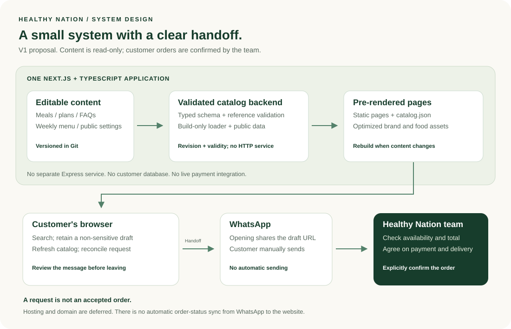

# Healthy Nation: V1 design proposal

[Documentation index](README.md) | [Product brief](product-brief.md) | [Review findings](reviews.md)

**Reviewed V1 direction approved for implementation.** Independent engineering and business/product reviews are complete; corrections are recorded here and in the prototype. See the [review register](reviews.md) for evidence, limitations, and dispositions. Hosting, DNS, and deployment are deliberately deferred.

## The recommendation in one sentence

Build one small Next.js + TypeScript application: public, mostly pre-rendered pages; a validated, editable menu catalog; and a browser-side request builder that hands off to WhatsApp without accepting orders or payments.

The public website is read-only. Selecting meals changes a draft in the customer's browser, not a database. A member of the Healthy Nation team accepts an order separately in WhatsApp.

## 1. System architecture

### What each part does

| Part | Responsibility | What it does not do in V1 |
| --- | --- | --- |
| Editable content | Store meals, supported options, meal plans, sample weekly menus, FAQs, and public business settings in typed files in Git. | Store customer records, addresses, medical notes, or payments. |
| Catalog validation | Check content structure, unique identifiers, menu references, prices, availability, and sample-versus-live status before publishing. | Invent missing prices, nutrition values, delivery coverage, or policies. |
| Read-only backend | Validate and query content at build time, supply public data to pages, and emit a versioned public catalog snapshot. | Run a separate HTTP service, accept purchases, mutate inventory, authenticate customers, or process payments. |
| Next.js frontend | Present searchable meals, plan comparisons, business information, and a request-review screen. | Promise that a displayed meal is reserved. |
| Browser draft | Retain non-sensitive meal selections and supported preferences across navigation in the same tab. | Send messages without the customer's action or persist sensitive personal data. |
| WhatsApp and the team | Receive the customer's message, verify the request, agree on payment/delivery details, and explicitly confirm the order. | Automatically synchronize order status back to the website. |

### Why not a separate backend service?

The content source is small and read-only. A separate Express service and database would introduce deployment, monitoring, credentials, and data-management work without improving the launch experience.

Next.js already contains both UI and server-side code. Server-rendered pages should call the catalog module directly rather than making an HTTP request to their own API.

**V1 baseline: no application API endpoints.** The read-only backend is the build-time content layer, not a permanently running service. Generate a public `catalog.json` artifact alongside the pages so an open browser can check freshness before handing off a request. This is a static file, not a database or an order endpoint.

Do not include `POST /orders`, payments, customer login, or menu editing. Add an HTTP catalog API only if a real separate consumer later requires one. Preliminary API scaffolding is not a commitment to include it in V1.

### TypeScript and module boundaries

- Keep content loading and full catalog validation in build/server-only modules. Invalid content fails the build with an actionable error.
- Define a serializable public catalog data-transfer object (DTO): only published customer-facing fields, revision, and validity metadata.
- Pass that DTO into small client components. Do not import the full content loader, schema validator, or server catalog singleton into the browser.
- Make draft reconciliation and message formatting pure functions that accept a public snapshot and explicit inputs. Share types with `import type`.
- Treat browser storage as untrusted. Retain narrowly scoped runtime validation for the saved draft without dragging the entire build-validation dependency graph into the client.

### Performance model

- Pre-render the homepage, menu, meal details, plans, and supporting content at build time where possible.
- Add client-side JavaScript only for search/filter controls, selections, and the WhatsApp message preview.
- Deliver optimized local images with explicit dimensions. The supplied logo stays local; no external font or image service is required to start.
- Content changes require a new build. This is the tradeoff for simple, inexpensive read-only delivery.
- **Recommended V1 delivery mode: static export.** Choose the vendor later, but design generated meal paths, static 404 handling, and image delivery for this mode now. Generate every published meal path; do not rely on `dynamicParams: true`, server actions, or a live Next.js image optimizer.
- Produce appropriately sized image variants at build time or use an explicitly selected image service later. Do not assume `next/image`'s default optimizer works on a static host.
- Publish pages, public catalog, configuration, and assets as one release. Configure the small catalog snapshot to revalidate rather than cache indefinitely.
- A server-backed Next.js runtime is a different future delivery choice, not an interchangeable configuration flag. Revisit its route, cache, image, and integration-test assumptions when V2 needs it.

### Catalog freshness and draft lifecycle

- Separate `draftSchemaVersion` from `catalogRevision`. Each published catalog has a revision, `publishedAt`, `validFrom`, and `validUntil`; publication validity is a business-owned launch setting, not an invented fixed order window.
- Retain the draft's source revision in same-tab session storage. Expire its live-offer eligibility at the catalog validity boundary. Keep it visible for correction instead of silently discarding it.
- Before an offer handoff, fetch the same-origin `catalog.json` with browser-cache bypass and an appropriate revalidation policy at the eventual host. Check that it is within its validity window.
- Reconcile all lines against that one snapshot. Preserve unchanged selections. Flag removed/unavailable meals, unsupported options, revised prices, and changed plan terms; require the customer to review affected lines again.
- If freshness cannot be established, keep the draft but block an offer-specific WhatsApp handoff. Allow copying a clearly labeled unverified draft and, if separately enabled, a general availability inquiry.
- Switching request purpose does not mix unrelated drafts. Keep meal and plan selections available to return to, but only include the active purpose in the reviewed message. Make any explicit reset reversible.
- Opening WhatsApp does not clear a draft or mark it completed. Clear only on an explicit customer reset; provide an undo opportunity. Closing the browser tab ends the session-storage lifetime.

## 2. User journeys

### Individual meals

1. See the delivery-area and ordering-window summary near Home/Menu entry, then browse the menu or open a featured meal.
2. Read the ingredients, allergens, portion, verified nutrition when available, and supported options.
3. Add the meal to a **request**, not a checkout cart.
4. Review quantities and preferences. Design ordinary meal cards around both price and stated portion. In the concept, mark missing prices and service facts pending; confirmed ordinary-meal pricing is a launch decision. Separate the known meal subtotal from unconfirmed delivery or other charges rather than implying a final total.
5. Preview the exact WhatsApp message.
6. Acknowledge that opening WhatsApp shares the prepared draft with WhatsApp, then manually send it to the business.
7. Receive availability, the final total, delivery details, and explicit acceptance from the team in WhatsApp.

**Important boundary:** Website events stop at the handoff. A WhatsApp click is not evidence that a message was sent, paid for, accepted, or delivered.

Provide the message as selectable text and a copy action before handoff. Keep this fallback available rather than trying to detect whether a native app opened. If clipboard access fails, explain how to select and copy manually. Do not prefetch WhatsApp URLs or send message bodies/full handoff URLs to analytics, error trackers, or session replay. Any future metrics must use an explicit non-sensitive event allowlist.

### Meal plans

Browse and compare plans -> review the sample weekly menu -> select a plan -> request a start date -> discuss and confirm through WhatsApp.

The initial meal plan is team-managed. It does not automatically renew or debit a card. Compare meal count and duration alongside delivery cadence, meal-choice/substitution rules, and delivery-fee treatment. Five meals delivered together is not equivalent to five daily deliveries. All these details, plus skips and cancellation terms, must be agreed before publication; show them as pending in the concept rather than inventing terms.

For another request, customers can revisit the current menu or message the team in their existing chat. Availability and terms are reconfirmed each time. This simple repeat-request path belongs in V1; accounts and automated reordering do not.

### Corporate catering and general inquiries

Use a separate inquiry entry point. Catering can ask for a requested date and approximate headcount. Neither flow requires adding a meal first. Avoid collecting addresses, diagnoses, or other sensitive information on the site.

## 3. Information architecture

Keep primary navigation small: **Menu, Meal plans, Our story**, plus a visible **Your request** action.

| Screen | Main purpose | Primary action |
| --- | --- | --- |
| Home | Explain the proposition and show the food and brand. | Browse the menu |
| Menu | Search/filter meals and understand available choices. | View meal / add to request |
| Meal detail | Explain one meal, its verified facts, and supported options. | Add to request |
| Meal plans | Compare options and show a sample weekly menu. | Ask about this plan |
| Request review | Review selected items and understand the handoff. | Preview request / open WhatsApp |
| Our story | Explain mission, values, and the people behind the food. | Explore the menu |
| FAQs | Explain actual ordering, ingredients, and business policies. | Ask a question |
| Corporate catering | Introduce a separate group-service inquiry. | Inquire about catering |

FAQs, contact details, and catering can be sections rather than separate top-level pages initially. The weekly menu belongs close to meal plans. Meal details should eventually have stable, shareable URLs.

The visual prototype concentrates on four screen families: Home, Menu with meal detail, Meal plans, and Request review. Supporting content is represented in sections rather than as a separate screen for every future route.

## 4. Proposed visual direction

**Direction: fresh, editorial, approachable.** This is a food brand, not a fitness dashboard or a medical service.

- Use the confirmed **Healthy Nation** name and original green-and-white logo.
- Use a white or softly warm background, deep-green primary actions, generous whitespace, and restrained sage/peach accents.
- Pair an expressive editorial heading style with a clean, readable sans-serif body style. Typography remains open for review; it is not inferred from the logo.
- Make food the visual focus. Use clearly labeled illustrations in this design review until actual meal photography is supplied.
- Keep mission language warm and practical. Avoid unverified claims, exaggerated health promises, fake social proof, or a luxury-only tone.
- On mobile, prioritize the meal name, dietary facts, portion, price status, and next action. Keep the request action reachable without covering content.

Working UI palette, not an official brand specification:

| Role | Proposed color |
| --- | --- |
| Deep green / primary text | `#173D2C` |
| Action green | `#0B763B` |
| White | `#FFFFFF` |
| Warm background | `#FAF9F4` |
| Sage accent | `#E4ECDD` |
| Peach accent | `#F2DFCF` |

Use sufficient text contrast, visible keyboard focus, meaningful headings and labels, large touch targets, and reduced-motion support. Check the final chosen colors and components before implementation.

## 5. Content and configuration boundaries

### Editable catalog

| Entity | Key fields |
| --- | --- |
| Meal | Stable ID and slug, name, description, photos, category, dietary tags, portion, price and currency, ingredients, allergens, verified nutrition if available, allowed options, availability, sample flag. |
| Meal plan | Stable ID, name, meal count, duration, delivery cadence, meal-choice/substitution rules, delivery-fee treatment, inclusions, price status, policy references, sample flag. |
| Weekly menu | Week/date label, day-to-meal references, sample/live flag. |
| FAQ | Stable ID, question, original answer, display order. |
| Business settings | Confirmed public name, contact links, response hours, service coverage, ordering windows, operating policies, and explicit publication/handoff approvals. |
| Catalog publication | Revision, publication time, valid-from/until timestamps, and preview/live status. |

### Request draft

Store only a draft schema version, source catalog revision, selected meal IDs, quantities, supported option IDs, selected plan, inquiry purpose, and optional requested date or catering headcount.

Use session-scoped storage for same-tab refresh/navigation continuity. Revalidate restored drafts against the current catalog. Do not put the whole draft into a page URL, and do not store free-form medical notes or payment/address data.

### Environment configuration

- Public WhatsApp business number: the owner supplied **+91 81049 60748** (`918104960748` in links), approving general and catering inquiries. This public setting is not a secret and does not enable sample-offer handoff.
- Public site origin: set only after the real domain is confirmed; useful for canonical metadata and sitemap URLs.
- No payment keys, database credentials, CMS tokens, or customer authentication secrets in V1.

The preview must not send requests to a guessed phone number or claim that `healthynation.in` is owned by the business.

### One shared handoff capability

Define a single fail-closed policy used by every entry point, not separate rules hidden in button labels.

- **Design preview:** local message preview/copy only. No real WhatsApp handoff.
- **General inquiry:** may be enabled separately only after the owner has verified the business number and approved the public contact configuration. It must not silently include sample meal or plan selections.
- **Meal/plan request:** also requires approved live publication, a freshly reconciled in-date catalog, and exclusively valid, available, non-sample selected offers. An approved number by itself cannot enable sample-offer requests.
- **Catering:** a separately approved general inquiry until actual catering offers and terms have been verified.

Number syntax validation is not ownership verification. Owner approval is a human launch gate. Test each entry point, missing/invalid configuration, preview/live combinations, and mixed sample/live selections.

## 6. States and failure handling

| Situation | Expected behavior |
| --- | --- |
| No search results | Show a clear empty state and a reset-filters action. |
| No selected meals | Explain how to add a meal; allow a separate general inquiry. |
| Meal unavailable, removed, or changed | Refresh the catalog, preserve unaffected selections, identify changed lines, and require review before continuing. |
| Old or malformed saved draft | Explain that it could not be restored and start a new draft; do not pretend restoration succeeded. |
| Browser storage unavailable | Keep the current in-memory selection and warn that it will not survive a reload. |
| WhatsApp unavailable | Show a copyable request and confirmed business contact details when available. |
| Missing contact configuration | Disable the real handoff and explain that business contact setup is incomplete. |
| Sample catalog | Clearly mark preview content and prevent live ordering from sample offers. |
| Message too long for reliable handoff | Offer copying the message instead of silently truncating it. |
| Invalid editable catalog | Fail validation/build with an actionable error rather than publishing corrupted content. |
| Unknown meal URL | Return a proper not-found page with a menu link. |

## 7. Publishing, operations, and release gates

### Content publishing and recovery

Assign a business content approver, technical release owner, and backup owner before launch.

1. The business approver verifies meal facts, prices, availability, delivery terms, contact settings, and publication validity.
2. The release owner updates typed content and runs validation, TypeScript checking, linting, focused tests, and the production export.
3. Review a preview for desktop/mobile customer flows and current menu correctness before releasing.
4. Publish pages, catalog snapshot, configuration, and assets atomically; then smoke-test a meal route, 404, catalog freshness, and approved handoff rules.
5. Keep a known-good artifact for rollback. Recheck current availability before restoring it: a technically sound old release may contain withdrawn offers.

Urgent unavailability uses the same validated correction/release path, owned by the primary or backup release owner. If the team cannot maintain that cadence, revisit a CMS or live availability feed rather than claiming that a code-edited menu is current.

### Acceptance criteria for the implemented V1

These are proposed acceptance targets, not measured results for the current prototype.

- Target WCAG 2.2 AA. Exercise keyboard-only navigation and request flows, visible/unobscured focus, meaningful names and status announcements, modal focus return, reduced motion, 200% text zoom, and reflow at 320 CSS pixels.
- Meet contrast ratios of at least 4.5:1 for normal text and 3:1 for large text and relevant interface boundaries/states. Prefer 44-by-44 CSS-pixel primary touch targets.
- Aim for field Core Web Vitals at the 75th percentile: LCP <= 2.5 seconds, CLS <= 0.1, and INP <= 200 milliseconds once sufficient field data exists. Lab checks are not substitutes for real-user measurements.
- Before launch, use a documented mobile lab profile, for example Lighthouse mobile navigation with its default simulated throttling, run repeatedly against a production build. Set an initial target of <= 200 KB compressed first-load JavaScript per main route and <= 200 KB per above-fold food image; revise consciously if actual measurements justify it.
- Exercise empty search/request states, denied storage, stale/expired catalogs, changed/removed selections, missing contact configuration, clipboard failure, and offline freshness checks.
- Confirm the prototype's simulation does not send messages; separately verify that production links encode the reviewed draft correctly without including personal or medical information.

### Manual business operation

The team needs an operating process, even when the site has no order database:

- Publish actual response hours and assign ownership of incoming WhatsApp requests.
- Maintain a private record of accepted orders and references.
- Verify any off-site payment independently.
- Send kitchen quantities and delivery requirements from confirmed orders, not website clicks.
- Handle cancellations, refunds, allergies, and special requirements using reviewed business policies.

Do not build automated messaging, a chatbot, delivery tracking, or a staff dashboard just to make V1 appear more complete.

### Business validation outside code

Treat customer fit and affordability as hypotheses until tested. Before launch, validate the main buying occasion and willingness to pay with prospective customers. Review contribution margin after ingredients, labor, packaging, delivery, food waste, and manual inquiry handling. Use a small pilot to check response speed, fulfillment reliability, and reasons to reorder.

Measure inquiries, accepted orders, fulfilled orders, and repeat purchases separately using the team's private register. Do not equate WhatsApp clicks with sales or add tracking of message text to compensate for the handoff boundary.

## 8. Future architecture boundaries

**V2: commerce.** Add a transactional database, server-side price and availability checks, delivery validation, payment-provider integration, authenticated payment webhooks, and a staff order-management workflow. Preserve order-line price snapshots. Handle duplicate payment events safely. A redirect from a checkout page is not proof of payment.

**V3: retention and recurring plans.** Consider customer accounts, reordering, meal-plan schedules, pauses/skips, renewal consent, recurring payments where supported, and operational automation. Define fulfillment rules separately from billing.

These are future changes, not reasons to add a database or payments to the read-only V1.

## 9. What this review should settle

1. Whether the overall brand direction feels premium but approachable.
2. Whether menu browsing or meal plans should receive the strongest homepage emphasis.
3. Whether the request-review step is clear enough before opening WhatsApp.
4. Whether the simple read-only backend and code-edited menu are sufficient for launch.

The owner has supplied founder **Shivansh Girdhar**, his **degree in Culinary Sciences**, and WhatsApp **+91 81049 60748**. Actual recipes, founder/food photos, verified food information, prices, service area, and policies remain launch inputs. Domain ownership and hosting setup remain deferred.

## Work status

Application implementation is in progress following owner approval. The initial scaffold is being reconciled with these reviewed boundaries. Project documentation and review artifacts are consolidated under `docs`. Publishing source does not deploy the site. The standalone clickable concept remains separate from the application and does not send messages or place orders.

This document records the accepted design direction, not a blanket claim that every implementation or business launch gate has passed. The root README links to the documentation index; the product brief and content-editing guide record supplied business facts and remaining inputs.
